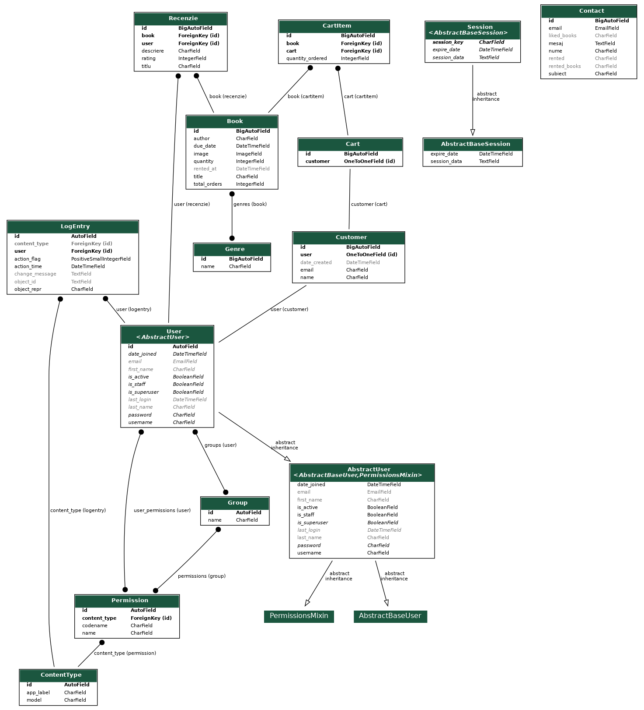

# BookForRent App 📚

[👉 BookForRent Live Demo](https://django-bookforrent-app.onrender.com/ "BookForRent Live Demo")

Welcome to my Bookstore Management System! This application is designed to streamline the process of managing a bookstore, with a special focus on the rental system. 

## Features 🌟

### For Readers 📖

- **Rent Functionality**: Rent your favorite books with ease! But remember, the clock is ticking - you have 24 hours to return the book.
- **Rate and Review**: Enjoyed a book? Rate it up to 5 stars and leave a review for others to see.
- **Discover Books**: Filter books by genre or search for a specific book. Discovering your next favorite read has never been easier!
- **Top Rented Books**: Curious about what others are reading? Check out the top rented books.
- **Contact the Manager**: Have a question or suggestion? You can contact the manager directly via email.

### For Admins 🛠️

- **Book Entry with Movie Search**: When you enter a new book, the system automatically searches YouTube for any movies made with the same title and displays it on the book's profile page.
- **Stock System**: Keep track of your inventory with our integrated stock system.
- **User Registration**: New users can easily register to use the system.
- **Book Management**: As an admin, you can add or delete books from the frontend.
- **API**: I've integrated REST FRAMEWORK

## Getting Started 🚀

To get started with our Bookstore Management System, follow the installation instructions below:

```
git clone https://github.com/adriandrinceanu/Django-BookForRent-App.git
cd Django-BookforRent-App
docker compose up
```
## Screenshots 🚀




